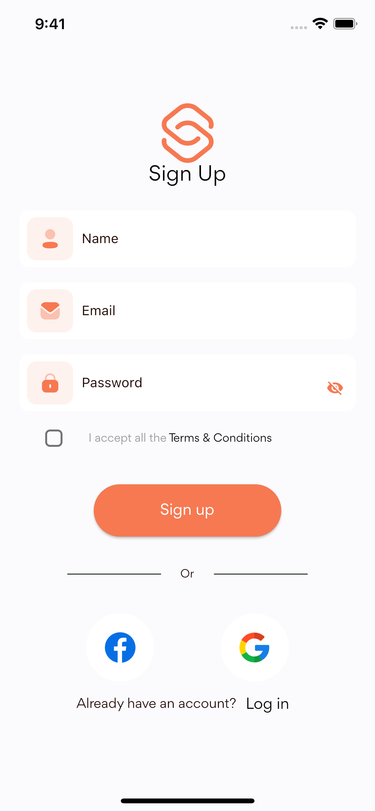

# E-commerce(WIP)

This project uses [Fake store api](https://fakestoreapi.com) to display categories, products and products by categories, this e-commerce app also allows users add products to cart and checkout cart.
On account creation, a user sees all products and categories and can view details of each product.

## Inspiration

Design inspiration [Figma](https://www.figma.com/file/xmvA4IeGM0pfmvCOUA6SAa/Clothing-E-Commerce-App?node-id=33%3A570)

## Screenshots

| Signup Screen | Login Screen | 
|    :---:     |     :---:      |  
|    |    |

| Home Screen | Product Screen | 
|    :---:     |     :---:      |  
|    |    |

| Cart Screen | Profile Screen | 
|    :---:     |     :---:      |  
|    |    |

## Features

• Authentication (Login)
• Add User
• Update User
• User can view categories
• User can view products by categories
• User can add product to cart
• User can view products in cart

## Contributions

🎉 Feel free to contribute to this project.

If you find a bug or want a feature and don't know how to fix, implement or go about it, please fill an [issue](https://github.com/GreatGodson/ice_app/issues) .

If you fixed a bug or implemented a feature, please send a [pull request](https://github.com/GreatGodson/ice_app/pulls).

